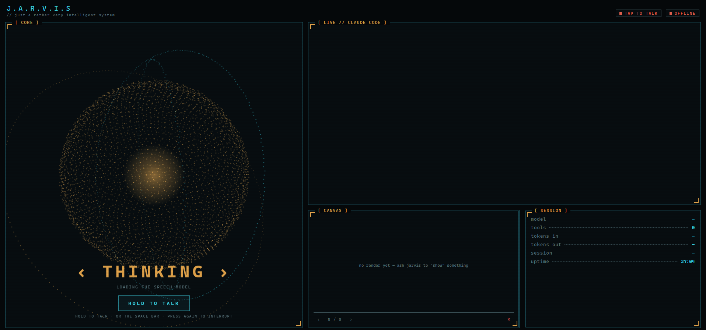
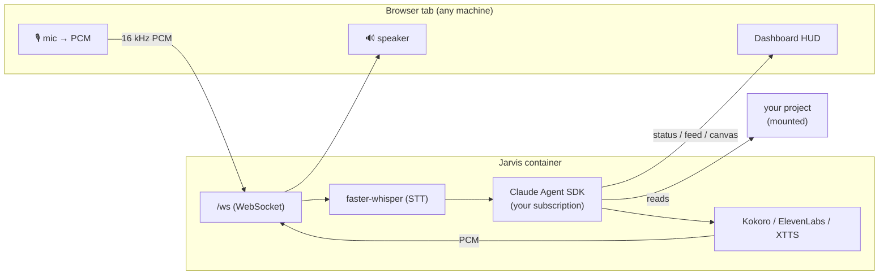

# J.A.R.V.I.S.

**A voice-driven, autonomous [Claude Code](https://claude.com/claude-code) companion you pull into any project — with a cinematic dashboard, an Iron-Man persona, and a voice that can be your own.**

Jarvis *is* a Claude Code session — same engine (the [Claude Agent SDK](https://code.claude.com/docs/en/agent-sdk)), same tools, same respect for your `settings.json` — wrapped with a persona and a voice, running on your **Claude subscription** (no per-token API bills). Launch it in a folder and it answers, out loud, strictly from what's actually in that project.



---

## Why

You already have Claude Code. Jarvis gives it a **face and a voice**: talk to it, watch it think on a live HUD, let it work while you're away and ping you on Telegram, and — if you like — have it answer in a cloned voice. It's one container: run it, open a browser tab, hold a button, and talk.

## Features

- 🧠 **It's real Claude Code.** Grounded in the current project (`CLAUDE.md` + `settings.json` + the actual Read/Grep/Glob tools), autonomous per your permissions, on your **subscription**.
- 🎙️ **Talk to it.** Push-to-talk voice: local speech-to-text ([faster-whisper](https://github.com/SYSTRAN/faster-whisper)), sentence-streamed replies for low latency. It narrates its own progress as it works.
- 🗣️ **Pick its voice — three engines, one switch.**
  - **Kokoro** — a British voice, fully **local, free, and offline** (no key). *Default.*
  - **ElevenLabs** — the premium cloud voice, when you have credits.
  - **Voice clone (XTTS-v2)** — drop in a reference clip and Jarvis speaks in **that** voice, zero-shot. No training.
- 🖥️ **A cinematic dashboard.** A four-panel "mission computer" HUD — an audio-reactive particle core, a live Claude Code transcript, a canvas for diagrams/charts/screenshots, and session stats. Served over WebSocket.
- 🌐 **The browser is the microphone.** In remote mode the dashboard tab captures your mic and plays the reply — so the brain can run on a beefy box (or in Docker) while you just open a tab and forward a port. No audio devices to wrestle with.
- 📟 **It reaches you.** Works silently on long tasks, then either speaks up or messages you on **Telegram** (reply by text *or* voice note). A heartbeat means it never goes quiet forever.
- 📦 **One container.** Everything — brain, STT, TTS, models — is baked into a Docker image. Run it, forward the port, done.

---

## Quickstart (Docker)

You need [Docker](https://docs.docker.com/get-docker/) and a Claude **Pro/Max/Team/Enterprise** plan.

```bash
git clone https://github.com/moebachar/jarvis.git
cd jarvis

# 1. Authenticate on your subscription (one-time; prints a ~1-year token)
claude setup-token
echo "CLAUDE_CODE_OAUTH_TOKEN=<paste-the-token>" > .env

# 2. Build + run (first build pre-fetches the models — a few minutes, once)
docker compose up --build

# 3. Open the dashboard, hold "HOLD TO TALK", and talk
#    → http://localhost:8765/
```

That's it. The dashboard is published on **`127.0.0.1:8765`** — a *localhost* address, which is what lets the browser grant microphone access, and it's never exposed on your network.

**Point it at another project** (instead of the Jarvis repo itself):

```bash
JARVIS_PROJECT=/path/to/your/project docker compose up
```

**From another machine** (brain on a server, browser on your laptop) — forward the port over SSH, then open the *localhost* URL locally:

```bash
ssh -L 8765:localhost:8765 <the-host-running-jarvis>
# then open http://localhost:8765/ on your laptop
```

### GPU (faster synthesis + the voice clone)

The voice clone (and snappier speech) wants an NVIDIA GPU. Install the [NVIDIA Container Toolkit](https://docs.nvidia.com/datacenter/cloud-native/container-toolkit/latest/install-guide.html), then uncomment **`gpus: all`** in `docker-compose.yml`. Without a GPU everything still runs on CPU (Kokoro is faster than real-time on a modern CPU).

### Lean CPU-only image

Skip the heavy voice-clone stack (torch) for a much smaller image:

```bash
docker compose build --build-arg WITH_CLONE=0 --build-arg GPU=0
```

---

## Voice cloning

Make Jarvis sound like a specific voice — no training, just one clean reference clip.

1. Build with the clone engine (the default: `WITH_CLONE=1`) and a GPU.
2. Put a clean **~15-30 s mono WAV** named **`jarvis-voice.wav`** in your project folder (the one mounted at `/project`).
3. Start the container. It detects the clip and speaks in that voice automatically.

> ⚖️ **Please use this responsibly.** Cloning a real, identifiable person's voice — e.g. an actor from a film — involves their likeness and the source recording's copyright. Keep cloned output to **personal use**, and don't distribute it. The reference clip is never committed or baked into the image (it's `.gitignore`d and mounted at run time) precisely so a shared image can't carry someone's voice.

---

## Configuration

**One layer.** There's no install-time or global config — everything is decided at run time from your project's optional `.jarvis/config.toml`, plus environment variables for secrets. Scaffold a starter with `jarvis --init`, or write it yourself:

```toml
# <your-project>/.jarvis/config.toml
[voice]
tts_engine   = "kokoro"     # "kokoro" | "elevenlabs" | "xtts"
kokoro_voice = "bm_george"  # bm_george | bm_lewis | bm_daniel | bm_fable
wake_enabled = false        # push-to-talk only (default)
whisper_model = "base.en"
whisper_device = "auto"     # auto → GPU if available, else CPU

[dashboard]
port = 8765

[telegram]
enabled = false             # set true + add a bot token to reach you when away
```

Secrets go in `.env` (never in the TOML), or straight into the container's environment:

| Variable | For |
|---|---|
| `CLAUDE_CODE_OAUTH_TOKEN` | **Required.** Subscription auth (from `claude setup-token`). |
| `ELEVENLABS_API_KEY` / `JARVIS_ELEVENLABS_VOICE_ID` | Only if `tts_engine = "elevenlabs"`. |
| `TELEGRAM_BOT_TOKEN` / `JARVIS_TELEGRAM_CHAT_ID` | Only for the Telegram bridge. |

> ⚠️ Do **not** set `ANTHROPIC_API_KEY` — it outranks the subscription token and would bill the API. Jarvis unsets it at startup regardless.

---

## How it works



A single async process runs an event bus, a state machine, the long-lived `ClaudeSDKClient`, and (in remote mode) an audio hub that bridges the dashboard WebSocket to the STT/TTS pipeline. The brain drives the outside world through custom in-process MCP tools; every turn is serialized through one lock so voice, REPL, and Telegram never collide.

---

## Local development (without Docker)

```bash
python -m venv .venv && . .venv/bin/activate       # Windows: .venv\Scripts\activate
pip install -e ".[all]"          # add ,desktop for local keyboard push-to-talk: ".[all,desktop]"
jarvis --init          # scaffold .jarvis/ in the current project
jarvis                 # text REPL   ·   jarvis --voice   ·   jarvis --remote
```

Handy commands: `jarvis --check-audio` (diagnose mic/speakers), `jarvis --demo-dashboard` (preview the HUD with no audio), `jarvis --telegram-id` (discover your chat id), `jarvis --version`.

---

## Notes & credits

- **Runs on your Claude subscription**, via the Agent SDK — not the pay-per-token API.
- Front-end libraries (Three.js, Mermaid, Chart.js) are **vendored** (no CDN calls). Speech models (Kokoro, faster-whisper, XTTS-v2) are downloaded from their upstreams at build time and retain their own licenses.
- The persona is an homage to a fictional character; the project isn't affiliated with or endorsed by anyone.

## License

MIT — see [`LICENSE`](LICENSE).
